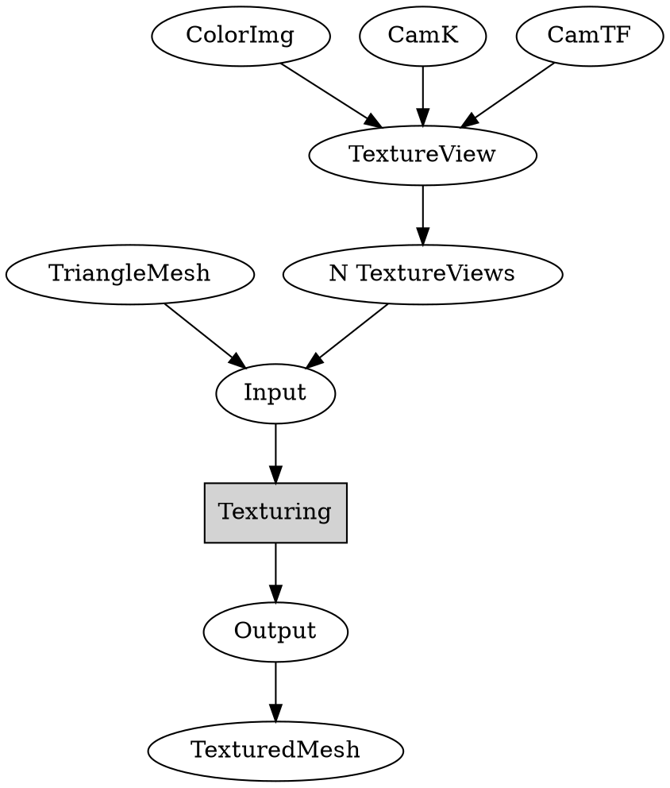
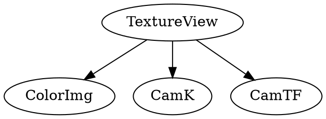
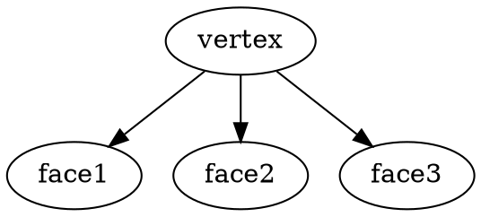
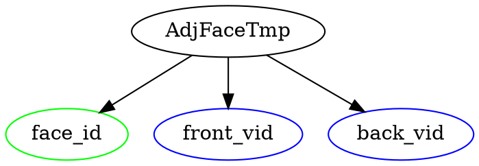
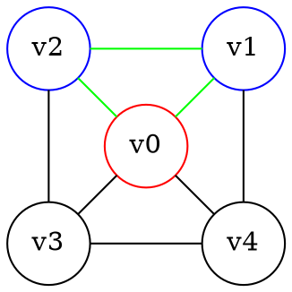
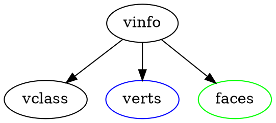
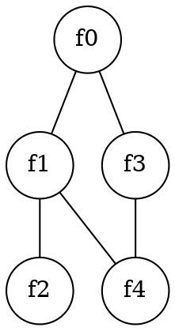
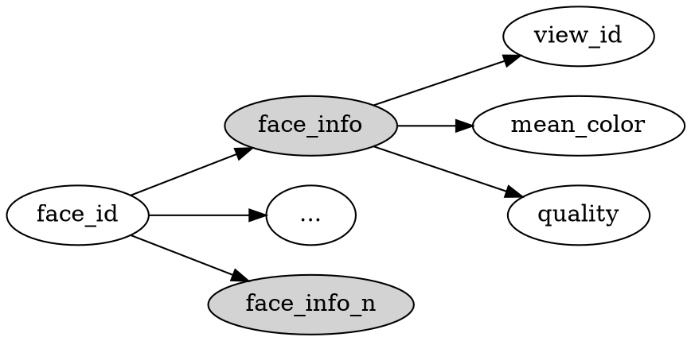
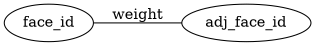

[TOC]

<style>
.graphviz { 
  display: flex; 
  justify-content: center; 
}
</style>

# Overview

<!-- dot {align="center"} -->



* code (forked): https://github.com/cggos/mvs-texturing
* paper: ***Let There Be Color! Large-Scale Texturing of 3D Reconstructions***
* video: https://www.youtube.com/watch?v=Ie-qLJdmlLI


# 1. Texture Views

```cpp
tex::generate_texture_views()
```




# 2. Mesh --> MeshInfo

```cpp
tex::prepare_mesh()
```

<p align="center">
  
</p>

## Check Mesh

```cpp
TriangleMesh::ensure_normals()
```

* Ensure face and vertex normals

## Init `MeshInfo`

```cpp
MeshInfo::initialize()
```

### Create `VertexInfo`

Add faces to their three vertices



### Update `VertexInfo`

Classify each vertex and compute adjacenty info

* Build new, temporary adjacent faces representation `AdjacentFaceList adj_temp` for ordering





* Sort adjacent faces by chaining them

  ```cpp
  AdjacentFaceList adj_sorted;
  ```

* update `VertexInfo`




# 3. Mesh + MeshInfo --> Adjacency Graph (`UniGraph`)

```cpp
tex::build_adjacency_graph()
```

对于每个 face，将mesh中与其每条 edge 邻接的 face 存入 `adj_faces`；将当前 face 与 `adj_faces` 中每个 face 建立 edge，构建 `UniGraph` 。





# 4. View Selection --> Best View Label :smile:

```cpp
tex::calculate_data_costs()

tex::view_selection()
```

## Calculate DataCosts

Calculates the data costs for each face and texture view combination, if the face is visible within the texture view.

```cpp
FaceProjectionInfos face_projection_infos(num_faces);
calculate_face_projection_infos(mesh, texture_views, settings, &face_projection_infos);
postprocess_face_infos(settings, &face_projection_infos, data_costs);
```

### Calculate `FaceProjectionInfo`

<p align="center">
  
</p>

```cpp
for (std::uint16_t j = 0; j < static_cast<std::uint16_t>(num_views); ++j) {
  TextureView * texture_view = &texture_views->at(j);
  // get view_pos and view_dir
  for (std::size_t i = 0; i < faces.size(); i += 3) {
    // get face_normal and face_center
    // compute and check viewing_angle
    // get face info
  }
}
```



### PostProcess Face Infos

create `hist_qualities::Histogram` using `info.quality`, and get the `upper_bound` when percentile=0.995

<p align="center">
  
</p>

compute data cost

* gmi
* area

```cpp
float normalized_quality = std::min(1.0f, info.quality / percentile);
float data_cost = (1.0f - normalized_quality);
data_costs->set_value(i, info.view_id, data_cost);
```

| DataCost | face0 | face1 | ... | faceN |
|:-:|-|-|-|-|
| view0 |
| view1 |
| ... |
| viewN |


## View Selection

### Data Association

#### Graph `mapmap::Graph<cost_t>`



#### LabelSet `mapmap::LabelSet<cost_t, simd_w>`

| view id | face0 | face1 | ... | faceN |
|:-:|-|-|-|-|
| view0 |
| view1 |
| ... |
| viewN |

#### Unaries

```cpp
using unary_t = mapmap::UnaryTable<cost_t, simd_w>;
std::vector<unary_t> unaries;
```

| | face_id | label_set | costs |
|-|-|-|-|
| unary0 |
| unary1 |
| ... |
| unaryN |


#### Pairwise

```cpp
using pairwise_t = mapmap::PairwisePotts<cost_t, simd_w>;
pairwise_t pairwise(1.0f);
```

### MAP-MRF :triangular_flag_on_post:

```cpp
mapmap::mapMAP<cost_t, simd_w> solver;
solver.set_graph(&mgraph);
solver.set_label_set(&label_set);
for(std::size_t i = 0; i < graph->num_nodes(); ++i)
    solver.set_unary(i, &unaries[i]);
solver.set_pairwise(&pairwise);
solver.set_logging_callback(display);
solver.set_termination_criterion(&terminate);
solver.optimize(solution, ctr);
```

The aim is to find a **labeling** for X that produces the lowest energy.

#### pairwise MRFs

<p align="center">
  
</p>

* the filled-in circles: **the observed nodes $Y_i$** (face)
* the empty circles: **the "hidden" nodes $X_i$** (view label)

#### MAP --> Minimum Energy

energy/cost function:

$$
\text{energy} (Y, X) = 
\sum_{i} \text{DataCost} (y_i, x_i) + 
\sum_{j = \text{neighbours of i}} \text{SmoothnessCost} (x_i, x_j)
$$

##### Tree MRFs via DP

<p align="center">
  
</p>


##### LBP

by OpenMVS

<p align="center">
  
</p>


# 5. Create Texture Atlases :smile:

```cpp
tex::generate_texture_patches()

tex::global_seam_leveling()
tex::local_seam_leveling()

tex::generate_texture_atlases()
```

## Generate Texture Patches

Generates texture patches using the graph to determine adjacent faces with the same label.

<p align="center">
  
</p>

## Global / Local Seam Levelling :triangular_flag_on_post:

* paper: *Seamless Mosaicing of Image-Based Texture Maps*

<p align="center">
  
</p>

without seam levelling

<p align="center">
  
</p>

## Texture Atlases

generate `TextureAtlas` from all of `TexturePatch`

<p align="center">
  
</p>

# 6. Mesh + Texture --> Obj Model

```cpp
tex::build_model()

tex::Model::save()
```

* .obj
* .mtl
* .png

<p align="center">
  
</p>


# 网格UV展开

上述纹理重建属于 **计算机视觉** 的内容，本节是其逆过程，属于 **计算机图形学** 的内容。

* http://geometryhub.net/notes/uvunfold


<p align="center">
  
</p>


# Reference

* [UV的概念及作用](https://www.zdaiot.com/ImageProcessing/UV%E7%9A%84%E6%A6%82%E5%BF%B5%E5%8F%8A%E4%BD%9C%E7%94%A8/)
* [【Let It Be Color！——3D重建之纹理重建】02-基于映射的纹理重建算法（上）](https://bbs.huaweicloud.com/blogs/195742)
* https://github.com/tyluann/3DTexture
* https://zhuanlan.zhihu.com/p/44424934
